<div align="center">

# DriveBuddy

**Your AI-powered driving companion for Singapore.**

Live drive tracking, post-trip cost breakdowns, real-time ERP / traffic / weather / parking, push alerts, an AI voice assistant, and behaviour-based recommendations, in one Expo app backed by a single NestJS API on AWS serverless.

[](https://github.com/elleskay/drivebuddy/actions/workflows/ci.yml)
[](https://github.com/elleskay/drivebuddy/actions/workflows/deploy-api.yml)
[](https://github.com/elleskay/drivebuddy/actions/workflows/security.yml)

Expo (React Native), NestJS, Prisma, Neon Postgres, AWS Lambda + API Gateway + SQS + EventBridge, the Anthropic Claude API plus Polly / Transcribe. Roughly **$0 to $2 per month**.

</div>

---

## Screens

<table>
  <tr>
    <td align="center">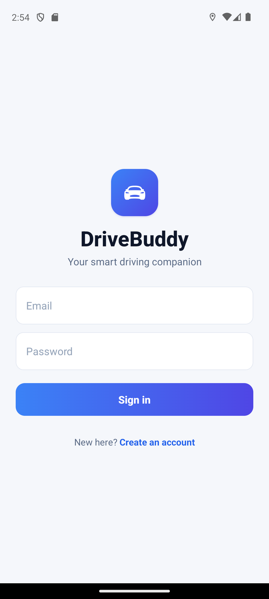<br/><sub><b>Sign in</b></sub></td>
    <td align="center">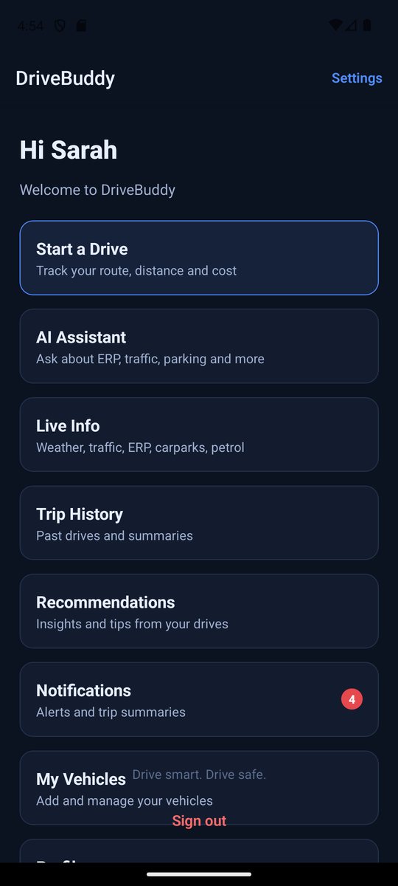<br/><sub><b>Home</b></sub></td>
    <td align="center">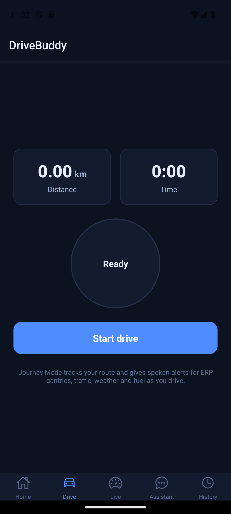<br/><sub><b>Journey Mode</b></sub></td>
  </tr>
  <tr>
    <td align="center">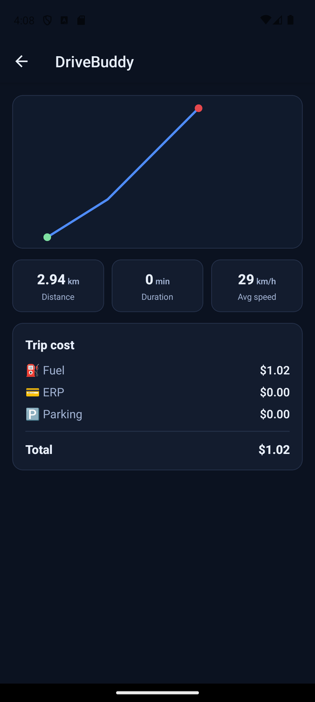<br/><sub><b>Trip Summary</b></sub></td>
    <td align="center">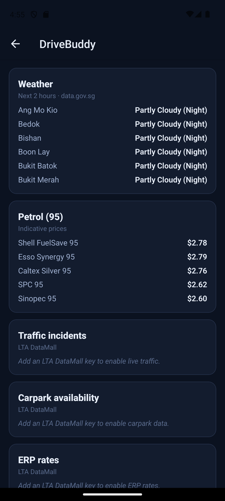<br/><sub><b>Live Info</b></sub></td>
    <td align="center">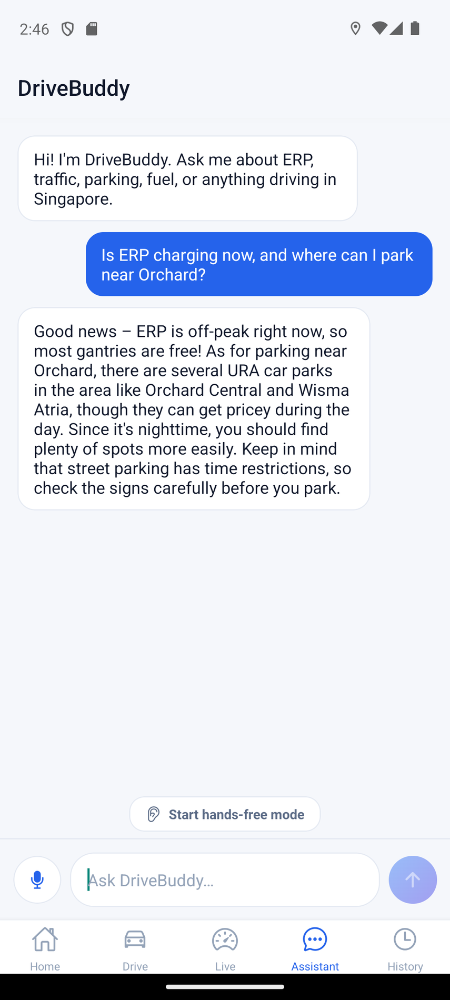<br/><sub><b>AI Assistant</b></sub></td>
  </tr>
  <tr>
    <td align="center">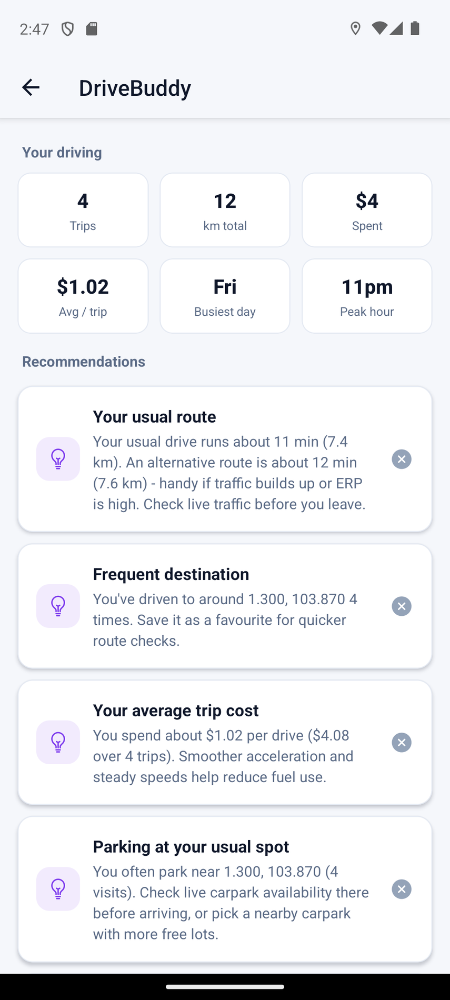<br/><sub><b>Recommendations</b></sub></td>
    <td align="center">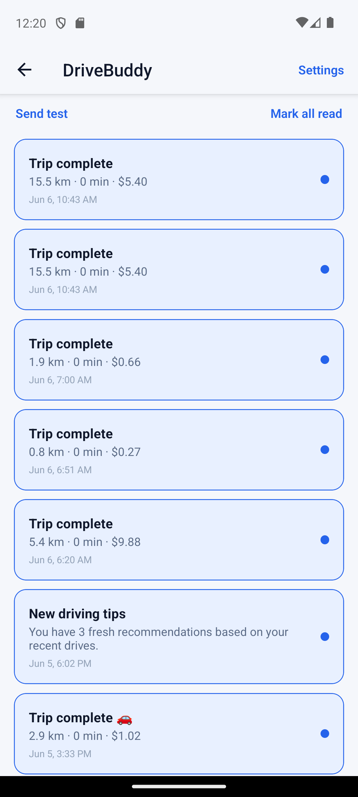<br/><sub><b>Notifications</b></sub></td>
    <td align="center">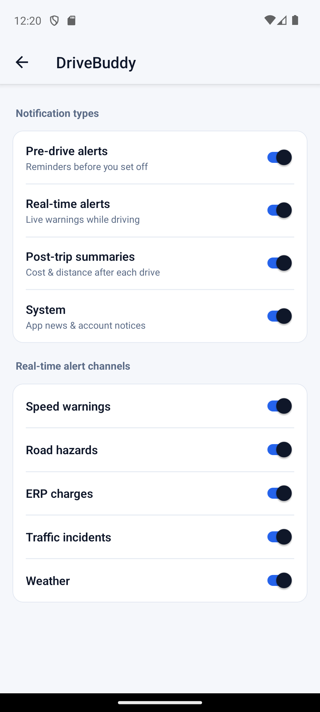<br/><sub><b>Alert Settings</b></sub></td>
  </tr>
  <tr>
    <td align="center">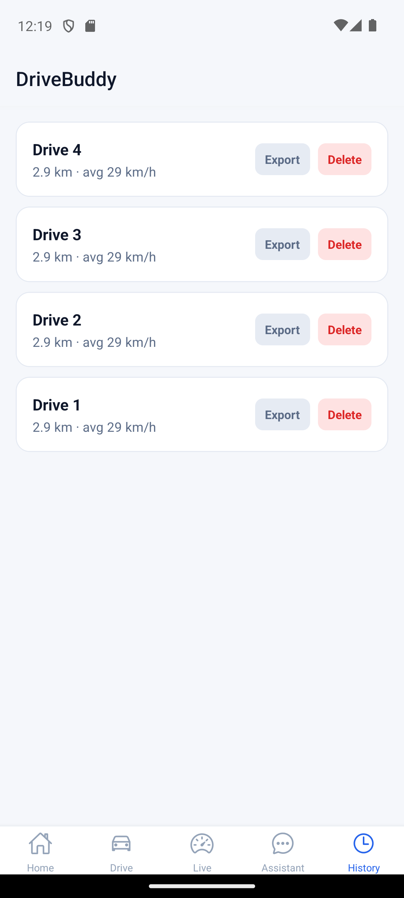<br/><sub><b>Trip History</b></sub></td>
    <td align="center">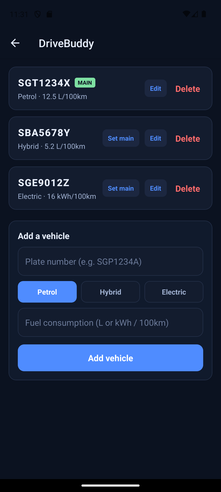<br/><sub><b>My Vehicles</b></sub></td>
    <td align="center">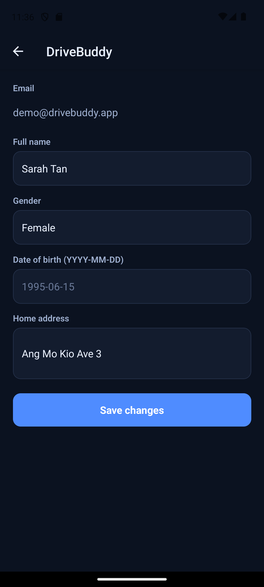<br/><sub><b>Profile</b></sub></td>
  </tr>
  <tr>
    <td align="center">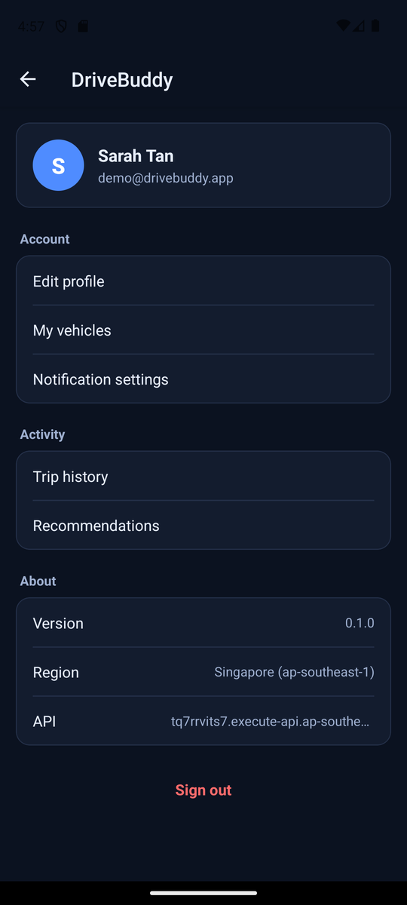<br/><sub><b>Settings</b></sub></td>
    <td align="center">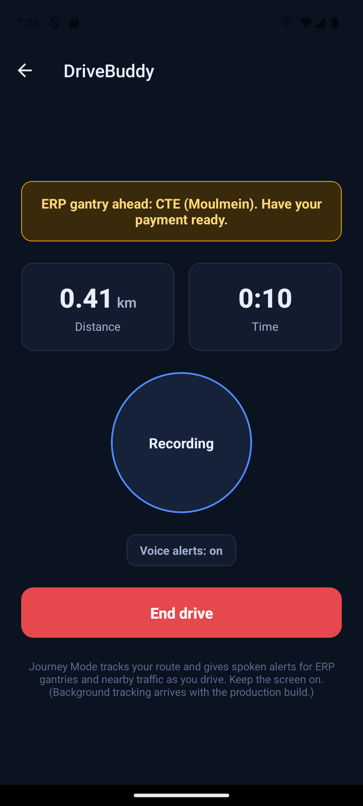<br/><sub><b>In-drive alert</b></sub></td>
    <td></td>
  </tr>
</table>

> Real screenshots captured from the app running on Android against the live API. Live traffic, ERP and carpark on the dashboard show "add LTA key" placeholders until a DataMall key is configured.

---

## Features

| Feature | What it does |
|---|---|
| **Journey Mode** | Records your drive with foreground and background GPS (`expo-location` + `expo-task-manager`, via an Android foreground service so it keeps recording with the screen off), batches points to the API, computes live distance/speed, and gives in-drive voice (`expo-speech`) and on-screen banner alerts for ERP gantries, traffic, weather and fuel as you drive. |
| **Post-trip summary** | On stop, generates a trip summary with the driven route drawn on an OpenStreetMap map (keyless raster tiles, no Google dependency) and an itemised cost breakdown: fuel (from your main vehicle's consumption over the distance), ERP, and parking. |
| **Live Info dashboard** | Singapore data in one place: 2-hour weather (data.gov.sg), petrol prices, and live traffic, ERP and carpark availability (LTA DataMall). Pull to refresh, cached. |
| **AI Assistant** | A voice and text assistant for Singapore driving questions: the Anthropic Claude API for answers, Polly for spoken replies, Transcribe for voice input. |
| **Notifications and push** | In-app notification center plus Expo push. Four types (pre-drive, real-time, post-trip, system) and five alert channels (speed, hazard, ERP, traffic, weather), each individually toggleable. |
| **Recommendations** | Behaviour insights (totals, average cost, weekly trend, peak hour, busiest day, frequent destinations) and grounded tips, refreshed by a daily background job. |
| **Vehicles and profile** | Manage multiple vehicles (Petrol / Hybrid / Electric, consumption, main vehicle) and your profile. |
| **Auth** | App-issued JWT (email and password) with access and refresh tokens, stored in `expo-secure-store`. |

---

## Architecture

The Expo app talks to one API Gateway HTTP endpoint, fronting a single NestJS HTTP Lambda. A second worker Lambda drains an SQS queue for push fan-out and the nightly analytics job. Data lives in Neon Postgres (Singapore) via Prisma.

```text
 Expo app  (React Native, Expo Router)
     |  HTTPS + JWT
 API Gateway  (HTTP API)
     |
 Lambda: HTTP  (NestJS, 7 modules) ......... Neon Postgres (ap-southeast-1, via Prisma)
     |   |   |                               (also reached by the worker)
     |   |   |__ Polly / Transcribe              (AI: TTS, STT)
     |   |______ S3  (audio scratch, 1-day TTL)
     |   |______ Anthropic Claude API            (AI: LLM, external HTTPS)
     |__________ data.gov.sg / LTA DataMall      (Singapore open data)
     |
     |  enqueue push
 SQS queue (+ DLQ)  ........  fed by EventBridge  (daily 02:00 SGT, analyze-all)
     |
 Lambda: Worker  ......... Neon Postgres
     |
 Expo Push Service
```

**One NestJS API, seven feature modules** (`auth`, `users`, `vehicles`, `external`, `drive-monitor` plus `trips`, `notifications`, `ai`, `route-analysis`) deployed as a single HTTP Lambda: right-sized and cheap, scale-to-zero.

### Tech stack

| Layer | Choice |
|---|---|
| Mobile | Expo / React Native, Expo Router, expo-location / -notifications / -av / -secure-store, react-native-svg |
| API | NestJS 10, class-validator, `@nestjs/jwt` plus passport-jwt, bcryptjs |
| Data | Neon serverless Postgres (Singapore) via Prisma 6 |
| Compute | AWS Lambda (ARM64, Node 20) behind API Gateway HTTP API |
| Async | SQS (plus DLQ) worker, EventBridge Scheduler (daily cron) |
| AI | Anthropic Claude API (LLM), Polly (TTS), Transcribe (STT), S3 |
| IaC | AWS CDK (TypeScript), the `NestjsApi` construct |
| CI/CD | GitHub Actions (OIDC, no stored keys): CI, Deploy API (CDK plus smoke test), Security, Mobile build (EAS) |

---

## Monorepo layout

```
drivebuddy/
  apps/drivebuddy/        Expo app (screens, lib/api.ts, auth, push)
  services/api/           ONE NestJS API
    src/<module>/         auth, users, vehicles, external, drive-monitor,
                          trips, notifications, ai, route-analysis, health
    src/worker.ts         SQS worker: push fan-out + daily analyze-all
    prisma/schema.prisma
  infra/cdk/drivebuddy/   CDK app: NestjsApi construct, S3, IAM, EventBridge cron
  infra/cdk/_setup/       GitHub OIDC deploy role
  docs/                   SETUP, DEPLOY, MOBILE, TESTING, screenshots
```

---

## Getting started

**Prerequisites:** Node 20+, an [Expo](https://expo.dev) account (for device runs), and a [Neon](https://neon.tech) Postgres connection string.

```bash
# 1. install
npm ci

# 2. backend (local)
cd services/api
cp .env.example .env            # set DATABASE_URL (Neon) and JWT_SECRET
npx prisma migrate deploy       # apply migrations
npm run start:dev               # NestJS on http://localhost:3000

# 3. app
cd ../../apps/drivebuddy
npx expo start                  # press 'i' or 'a', or scan with Expo Go
```

The app reads its API base URL from `EXPO_PUBLIC_API_URL` (falling back to `app.json`, key `extra.apiUrl`).

### Deploy the API

Push to `main` and the **Deploy API** workflow runs migrations, builds, runs `cdk deploy`, and smoke-tests the live URL. Or run it locally:

```bash
cd infra/cdk/drivebuddy
DATABASE_URL=... JWT_SECRET=... npx cdk deploy
```

---

## Cost

Scale-to-zero everywhere: AWS Lambda plus API Gateway plus a tiny S3 bucket plus a free Neon tier, roughly **$0 to $2 per month** with light use. No Fargate, no NAT gateway, no load balancer, no idle database.

---

## Status and roadmap

All planned phases (A to H) are built and verified live. A few items depend on external accounts or keys:

- [ ] **LTA DataMall key**: set the `LTA_ACCOUNT_KEY` secret to enable live traffic, ERP and carpark (env already wired).
- [ ] **EAS / store builds**: run `eas init` and set the `EXPO_TOKEN` secret to produce installable builds and enable on-device push.
- [ ] **Native enhancements**: an interactive pan/zoom map (the trip map currently renders OpenStreetMap raster tiles with the route overlaid), an on-device wake-word, and a floating overlay over other nav apps (require further native work). Background GPS, in-drive voice alerts, and hands-free continuous voice are implemented.

---

<div align="center"><sub>Drive smart. Drive safe.</sub></div>
