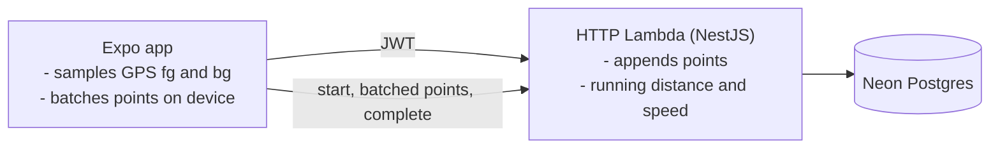
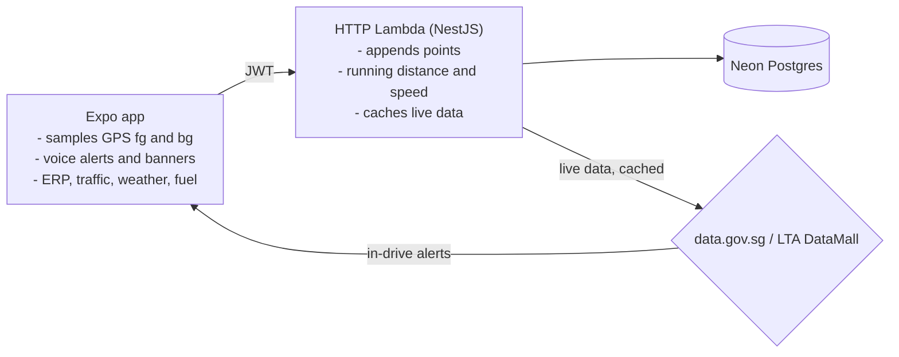
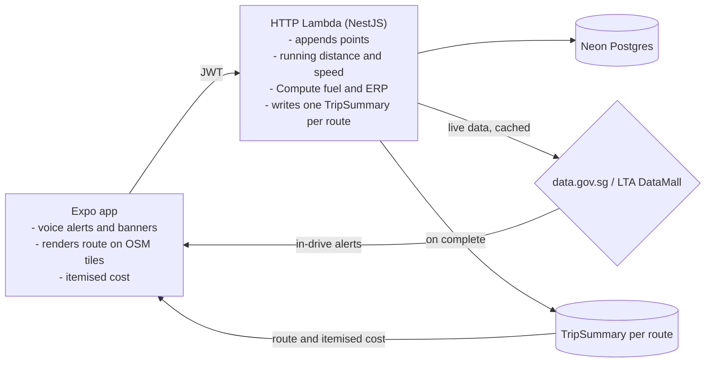
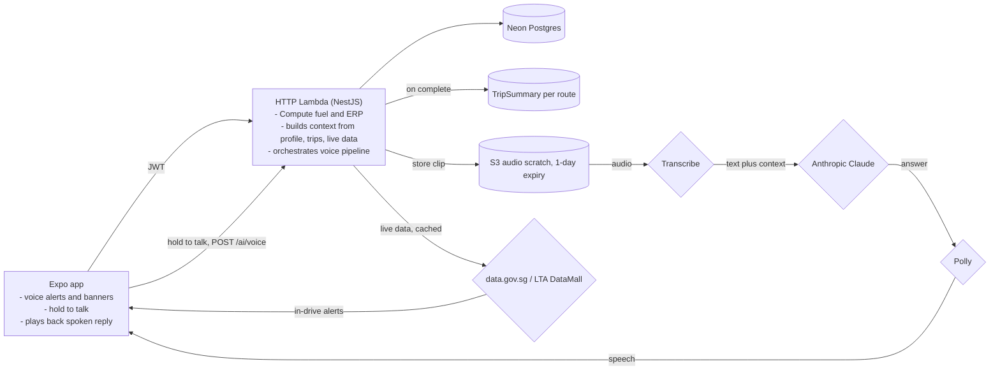
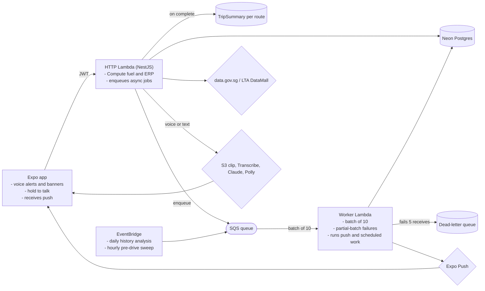
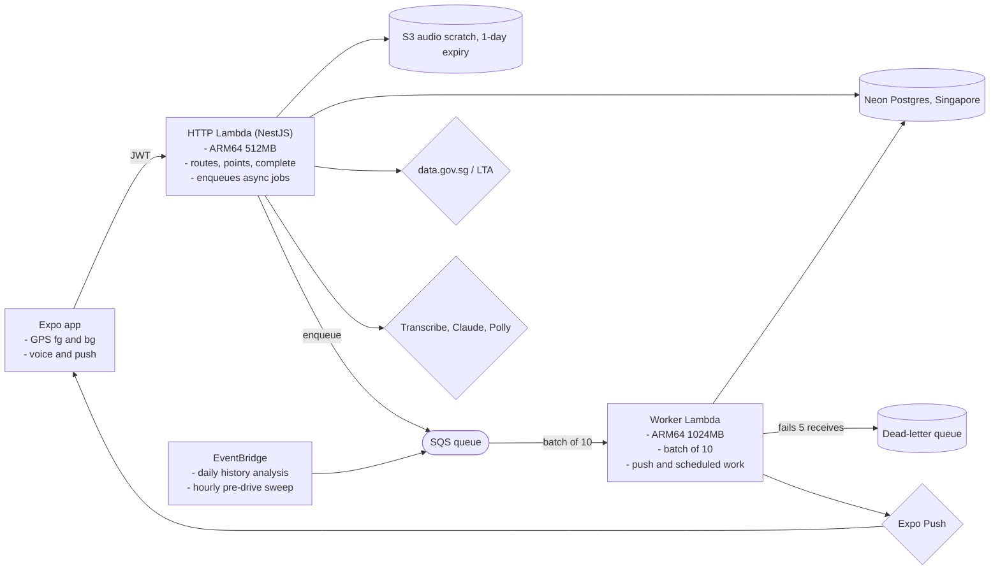

# DriveBuddy System Design

> A system design breakdown of DriveBuddy, an AI driving companion for Singapore. It records your drive in the background, costs every trip, surfaces live ERP, traffic, weather, and parking, answers questions by voice, and runs almost entirely scale-to-zero for roughly zero to two dollars a month.
>
> **Live demo** at https://elleskay.github.io/drivebuddy/ with the account demo@drivebuddy.app and password DriveBuddy123!
>
> **Live API health** at https://tq7rrvits7.execute-api.ap-southeast-1.amazonaws.com/health

---

## Understanding the Problem

DriveBuddy is one Expo app backed by one NestJS API. It records a real drive with GPS, talks to the driver as they approach an ERP gantry or heavy traffic, costs the trip on stop, shows live Singapore driving data, and answers questions by voice or text grounded in the driver's own history.

The shaping constraints are unusual for a side project. The app must record a drive accurately while the phone is locked in a pocket, without draining the battery, and the whole backend must cost almost nothing when no one is driving. Those two pressures, reliable background capture and near-zero idle cost, drive most of the design.

### Functional Requirements

- Users should be able to record a drive with GPS, foreground and background, and watch live distance and speed.
- Users should be able to get voice and on-screen alerts for nearby ERP gantries, traffic, weather, and fuel while driving.
- Users should be able to see a costed trip summary on stop, fuel plus ERP (parking is a reserved field, currently zero), with the route drawn on a map.
- Users should be able to see a live Singapore dashboard of weather, petrol prices, traffic, ERP, and carpark availability.
- Users should be able to ask an AI assistant, by voice or text, questions grounded in their profile, vehicles, trips, and the live data.
- Users should be able to manage multiple vehicles and a profile, and sign in with email and password.

Out of scope: turn-by-turn navigation (the trip map draws the recorded route over keyless OpenStreetMap tiles), multi-user and social features, and any always-on infrastructure.

### Non-Functional Requirements

- The backend should cost roughly $0 to $2 a month with light use, which means scale-to-zero everywhere.
- Background recording should sample GPS about once a second and survive a locked screen and brief signal loss without dropping points or flattening the battery, by buffering and flushing in small batches.
- Live data should paint immediately, served from cache and refreshed on pull.
- Async work, push fan-out and scheduled jobs, should retry on failure and dead-letter after 5 attempts, so nothing is silently lost.
- Location and auth data should be handled securely, with JWT access and refresh tokens and least-privilege IAM.
- The system should be deterministically testable despite native device behaviour and a non-deterministic model.

---

## The Set Up

### Planning the Approach

DriveBuddy is one mobile client and one NestJS API, and the key trick is that the same API binary has two entry points, an HTTP handler and a queue worker. Durable user data lives in a serverless Postgres. Anything slow or scheduled, push fan-out, the nightly history analysis, the hourly pre-drive sweep, is pushed onto a queue so the request path stays fast. Because near-zero idle cost is a first-class requirement, every piece is serverless and scales to zero, with no load balancer, no NAT, and no always-on database.

### Defining the Core Entities

Nine Prisma models on Neon Postgres. A user owns everything below it, and a drive owns its points and its single summary.

- **User**, the account, holding email, password hash, name, and provider.
- **Vehicle**, one of the user's vehicles, holding the plate, fuel type, consumption, and a main flag.
- **DrivingRoute**, one recorded drive, holding an active flag, total distance, average speed, and start and end times.
- **RoutePoint**, one GPS sample on a route, holding timestamp, latitude, longitude, and speed.
- **TripSummary**, the costed result of a drive, holding distance, duration, and the ERP, fuel, and parking costs.
- **Notification**, one message to the user, holding a type, title, body, and read flag.
- **NotificationSettings**, the user's per-type and per-channel toggles.
- **Recommendation**, one insight or tip, holding a category, a score, and a dismissed flag.
- **DeviceToken**, a registered push token for one device.

### API or System Interface

A REST API behind an API Gateway HTTP API, JSON in and out. Every route takes a bearer JWT except the three auth routes and the public `/external` and `/health` routes. The user id always comes from the JWT, never the body. The core endpoints:

Auth endpoints (register/login/refresh). These three are the only unauthenticated POSTs: register creates an account and hands back the first token pair, login exchanges credentials for a fresh pair, and refresh trades a still-valid refreshToken for a new access/refresh pair so a session can outlive a short-lived access token. POST throughout because each call creates server-side state (a new user or a new token pair), not a read.

```
POST /auth/register -> { accessToken, refreshToken }
Body: {
  email, password, fullName
}
POST /auth/login -> { accessToken, refreshToken }
Body: {
  email, password
}
POST /auth/refresh -> { accessToken, refreshToken }
Body: {
  refreshToken
}
```

Drive-monitor lifecycle (routes/points/complete). This is the recording path: the first POST opens a route and returns its id, the points POST appends a batch of GPS samples to that route (the app buffers on device and sends them in groups rather than one request per fix), and the complete POST stops the drive and triggers costing, returning the TripSummary. All three are POST because each one mutates the route: it is created, extended, then finalised, none of which is a cacheable read.

```
POST /drive-monitor/routes -> Route (start a drive, returns the route id)
Body: {
  name?
}
POST /drive-monitor/routes/{id}/points -> Success
Body: {
  points: [ { latitude, longitude, timestamp, altitude?, speed?, accuracy? } ]
}
POST /drive-monitor/routes/{id}/complete -> { route, summary } (stop and cost the drive, no body)
```

Trip history (list/get). The collection route returns the caller's completed trips and the item route returns a single trip summary (the full GPS point track comes from the drive-monitor route). Both are GET because they only read stored trips, and the user id is taken from the JWT so a caller only ever sees their own.

```
GET /trips -> Trip[]
GET /trips/{id} -> Trip
```

External dashboard feeds (one route per source). A single GET fronts the live Singapore data feeds (weather, traffic, ERP, carpark, petrol), returning the server-cached snapshot the app overlays during a drive. It is public (no JWT) and a GET because the data is shared and read-only, which is exactly what lets the server cache one copy and serve every driver from it.

```
GET /external/dashboard/{weather|traffic|erp|carpark|petrol} -> Dashboard
```

Assistant text endpoint (/ai/ask). A POST sends a typed question, and the server grounds it in the caller's profile, vehicles, recent trips, and the live feeds before answering, optionally returning spoken audio when speak is set. POST because each ask drives fresh server-side work (context assembly and a model call), not a cacheable lookup.

```
POST /ai/ask -> Answer
Body: {
  text, speak?
}
```

Assistant voice endpoint (/ai/voice). A POST carries a base64 audio clip, and the server runs the hands-free pipeline (store the clip, transcribe it, answer against the same grounded context, then synthesize speech) so the driver can talk and listen without touching the screen. POST because the body is a sizeable upload that kicks off real processing, which would not fit a GET.

```
POST /ai/voice -> Answer
Body: {
  audioBase64, format?, speak?
}
```

Vehicles and notifications. Vehicles are full CRUD over the collapsed verb set: GET to list, POST to add, PATCH to edit (for example marking the main vehicle whose fuel consumption drives cost), and DELETE to remove. Notifications use the same shape for list, mark-read, and settings, with mark-read as a POST and settings as a PATCH chosen over PUT so a single preference can change without resending the whole object.

```
GET/POST/PATCH/DELETE /vehicles, /notifications
```

The one shape worth showing is the costed trip, returned on complete:

```json
{ "distanceKm": 12.4, "durationMin": 26, "fuelCost": 3.10, "erpCost": 2.00, "parkingCost": 0.00 }
```

---

## High-Level Design

We build the design one functional requirement at a time.

### 1) A user can record a drive and watch it live

The app starts a drive, then samples GPS in both the foreground and a background task so recording continues with the screen off. Points are batched and posted to the API, which appends them and keeps a running distance and speed.

We start with the recording path: the app and the API over a JWT, points appended to the database.



### 2) The app gives in-drive alerts

While driving, the app checks nearby ERP gantries, traffic, weather, and fuel against the live data, and raises a voice alert and an on-screen banner as the driver approaches each one, so the driver is informed without looking at the screen.

We add the live-data feeds and the in-drive alerts they raise.



### 3) The drive is costed into a trip summary on stop

On complete, the API computes fuel from the main vehicle's consumption over the driven distance and the ERP charge from the gantries passed (parking is a reserved field, currently zero), then writes one TripSummary per route. The app renders the route over OpenStreetMap raster tiles with an itemised cost, which keeps the map keyless.

We add the cost step on stop and the map the trip renders on.



### 4) A user can ask an AI assistant by voice or text

For text, the API builds a context from the user's profile, vehicles, recent trips, and the live data, then asks Claude. For voice, the clip is stored briefly in S3, Transcribe turns it into text, Claude answers against the same context, and Polly turns the answer into speech, so the driver can talk and listen hands-free.

We add the assistant. The voice path stores a clip, transcribes it, answers against the same context, and speaks the reply back.



### 5) Notifications and scheduled intelligence run asynchronously

Push fan-out, the daily history analysis, and the hourly pre-drive sweep never run on the request path. The HTTP Lambda enqueues a job, EventBridge fires the schedules, and a separate worker Lambda drains the queue in batches.

We add the async tier off the request path. That completes the logical design (the voice pipeline from step four is collapsed into one node here for the whole-system view).



---

## Potential Deep Dives

### 1) How do we record a drive in the background without draining the battery or losing points?

A drive must be captured while the phone is locked in a pocket.

<details>
<summary><strong>Bad solution: keep the app open and poll</strong></summary>

Sample GPS only while the app is in the foreground with the screen on. The moment the phone locks or the driver switches apps, recording stops and the drive is lost, and holding the screen on flattens the battery.
</details>

<details>
<summary><strong>Good solution: foreground location updates</strong></summary>

Use the platform location updates while the app is open. This captures a drive as long as the user never leaves the screen, which is not how anyone drives, so real trips still get cut off when the phone locks.
</details>

<details>
<summary><strong>Great solution: a background task and batched points</strong></summary>

Run a background location task through expo-location and expo-task-manager, backed by an Android foreground service, so sampling continues with the screen off. Points are buffered on the device and posted in batches, so a screen lock or brief signal loss does not drop the drive, and batching keeps radio use and request count down. This is what DriveBuddy runs.
</details>

### 2) How do we run push and scheduled work reliably and cheaply?

Push fan-out and the nightly analysis are slow and must not block a user request or be lost on failure.

<details>
<summary><strong>Bad solution: do it inline in the request</strong></summary>

Send pushes and run the history analysis inside the HTTP request that triggered them. The user waits on work they do not care about, a slow third party stalls the response, and any failure loses the work.
</details>

<details>
<summary><strong>Good solution: a timer or a single cron box</strong></summary>

Move the work to a timer in the app or one always-on cron server. The app cannot be relied on to be open, and an always-on box costs money around the clock and still has no real retry story.
</details>

<details>
<summary><strong>Great solution: a queue, a worker, and schedules</strong></summary>

The HTTP Lambda enqueues jobs onto SQS, a separate worker Lambda drains them in batches with partial-batch failures, a dead-letter queue catches anything that fails five times, and EventBridge fires the daily and hourly jobs. The request path stays fast, work retries safely, and nothing runs when idle. This is what DriveBuddy runs.
</details>

### 3) How do we keep the whole system near zero cost?

Near-zero idle cost is a stated requirement, not an afterthought.

<details>
<summary><strong>Bad solution: the always-on textbook stack</strong></summary>

Containers on Fargate behind a load balancer with a managed, always-on database. Correct and familiar, and it bills real money every hour even with no users.
</details>

<details>
<summary><strong>Good solution: autoscaling containers</strong></summary>

Containers that scale in when idle. Cheaper, but the load balancer and the database still bill around the clock, and scaling up from low is slow.
</details>

<details>
<summary><strong>Great solution: scale-to-zero everywhere</strong></summary>

Lambda behind an HTTP API gateway, a serverless Postgres on a free tier, a tiny S3 bucket with a one-day expiry, and no VPC, NAT, or load balancer. With light use the bill is roughly zero to two dollars a month, and there is nothing to pay for when no one is driving. This is what DriveBuddy runs.
</details>

### 4) How does the AI assistant stay grounded and answer by voice?

The assistant must lean on the driver's own data, not just general knowledge, and work hands-free.

<details>
<summary><strong>Bad solution: send only the question</strong></summary>

Pass the raw question to the model. Answers are generic and ignore the driver's vehicles, trips, and the current conditions, which is exactly the value the app is supposed to add.
</details>

<details>
<summary><strong>Good solution: prepend recent data as a blob</strong></summary>

Glue some recent trips and profile fields onto the prompt as text. Better, but unstructured, easy to overflow the context, and it gives the model no clean way to tell what is current.
</details>

<details>
<summary><strong>Great solution: a structured context and a voice pipeline</strong></summary>

Assemble a structured context from the profile, vehicles, recent trips, and the live data, and send it with the question. For voice, store the clip in S3, Transcribe it to text, answer with Claude against that context, then synthesize the reply with Polly, so the driver can talk and listen hands-free. The audio scratch bucket expires clips after a day.
</details>

### 5) How do we test native behaviour that JavaScript cannot reach?

Background GPS and push run at the OS level, so JS tests cannot exercise them, yet a 100 percent gate would claim they are covered.

<details>
<summary><strong>Bad solution: mark them covered and hope</strong></summary>

Tag the native requirements as covered with no real check. The gate now lies, and a regression in call blocking or background capture ships unnoticed.
</details>

<details>
<summary><strong>Good solution: manual QA each release</strong></summary>

A person tests on a real device before each release and notes it in a doc. Real evidence, but unenforced and easy to skip under time pressure, and nothing ties it to the build.
</details>

<details>
<summary><strong>Great solution: signed verification artifacts</strong></summary>

Prove those requirements with committed real-device evidence that is checksum-stamped and sits on a commit signed by an allowed signer, and that goes stale on an app-version change, an OS-baseline bump, or a 90-day expiry. The gate enforces it, so native behaviour cannot ship on missing, tampered, unsigned, or expired evidence.
</details>

---

## The complete design

Pulling the high-level design and the deep dives together, here is the whole system in one view. Everything is serverless and scales to zero, no VPC, NAT, or load balancer: an API Gateway HTTP API, ARM64 Lambdas (HTTP 512MB, worker 1024MB), Neon Postgres in Singapore, and S3 audio scratch on a 1-day expiry.



## Tech stack

| Layer | Tech |
|---|---|
| Mobile | Expo and React Native, Expo Router, expo-location, expo-task-manager, expo-notifications, expo-speech, expo-secure-store |
| Web demo | Expo web export with react-native-web on GitHub Pages |
| API | NestJS 10, class-validator, JWT with passport, bcryptjs |
| Data | Neon serverless Postgres (Singapore) via Prisma 6 |
| Compute | AWS Lambda (ARM64, Node 20) behind an API Gateway HTTP API |
| Async | SQS with a dead-letter queue, EventBridge daily and hourly schedules |
| AI | Anthropic Claude API for answers, Polly for speech, Transcribe for voice input, S3 scratch |
| IaC | AWS CDK (TypeScript), the reusable NestjsApi construct |
| CI/CD | GitHub Actions with OIDC, no stored keys, plus EAS for app builds |
| Quality | Spec-driven coverage gate, Vitest, jest-expo, Maestro, CodeQL, gitleaks |

## License

MIT.
