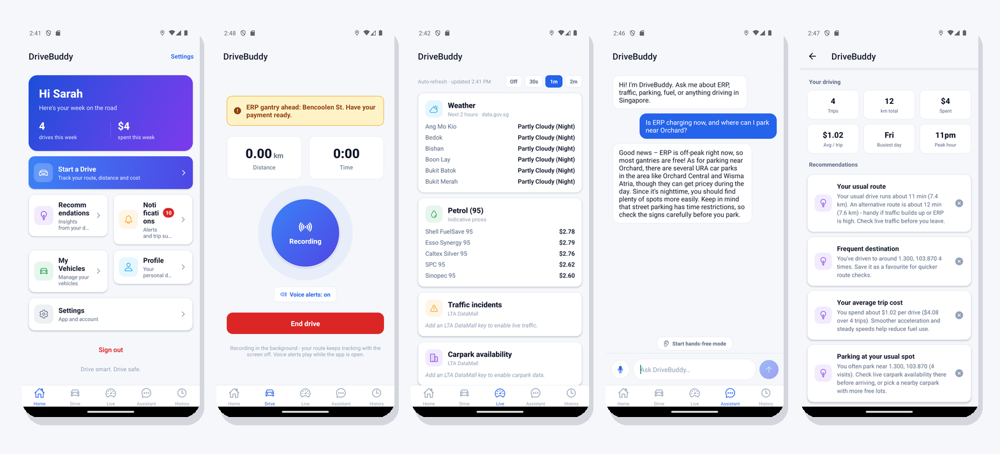
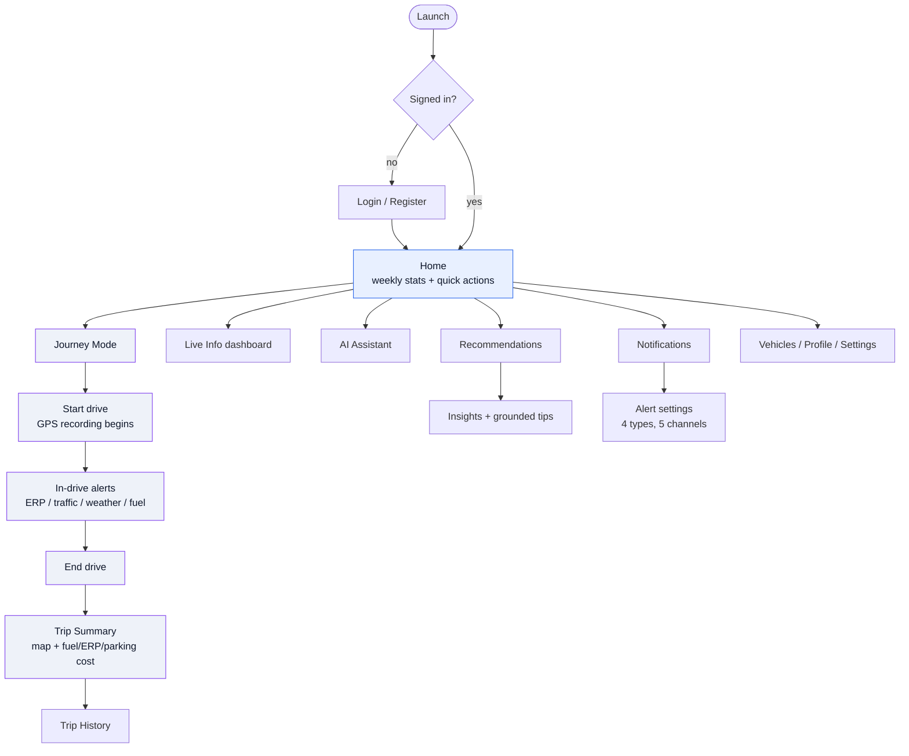
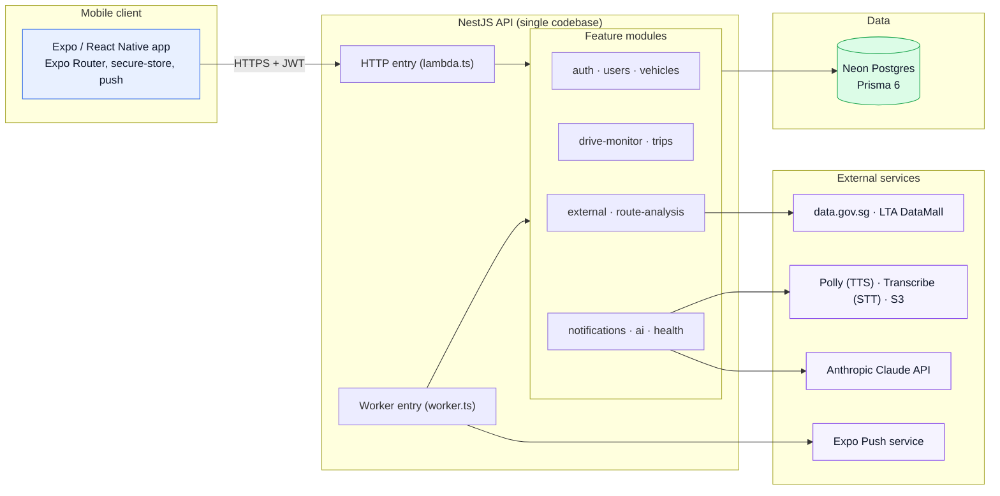
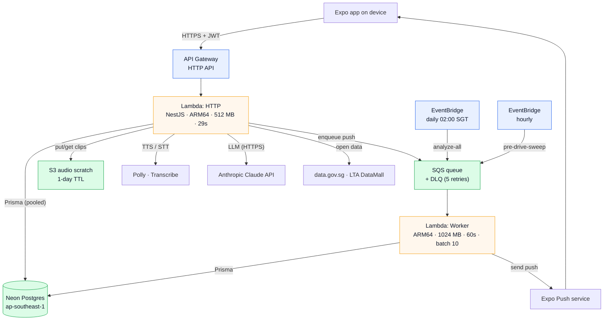
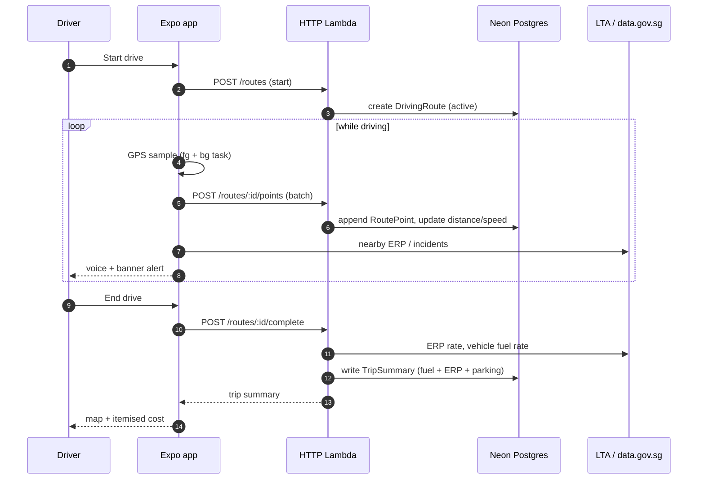
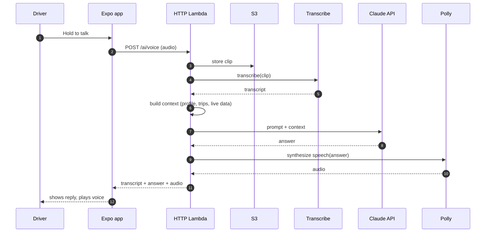
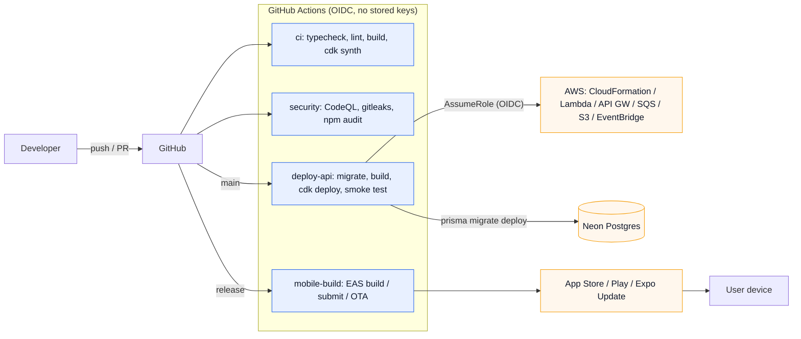
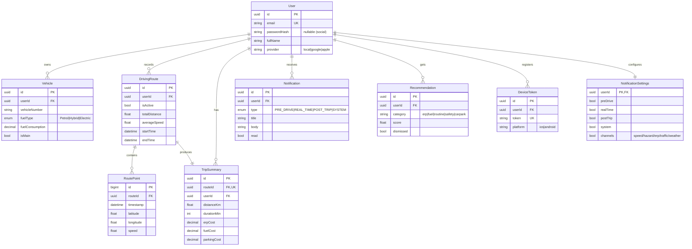
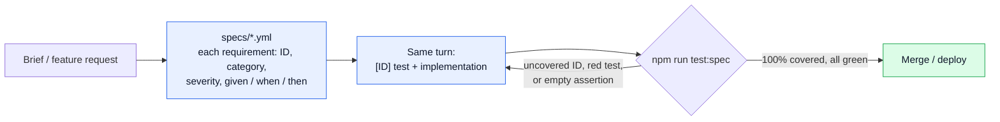

<div align="center">

# DriveBuddy

### Your AI-powered driving companion for Singapore

Live drive tracking, post-trip cost breakdowns, real-time ERP / traffic / weather / parking,
push alerts, an AI voice assistant, and behaviour-based recommendations.
One Expo app, one NestJS API, fully serverless on AWS. Roughly **$0 to $2 per month**.



[](https://github.com/elleskay/drivebuddy/actions/workflows/ci.yml)
[](https://github.com/elleskay/drivebuddy/actions/workflows/deploy-api.yml)
[](https://github.com/elleskay/drivebuddy/actions/workflows/security.yml)


</div>

---

## Table of contents

- [Highlights](#highlights)
- [Screens](#screens)
- [Features](#features)
- [App flow](#app-flow)
- [Logical architecture](#logical-architecture)
- [Physical architecture (AWS)](#physical-architecture-aws)
- [Key sequences](#key-sequences)
- [Deployment](#deployment)
- [Database design](#database-design)
- [Spec-driven development](#spec-driven-development)
- [Tech stack](#tech-stack)
- [Monorepo layout](#monorepo-layout)
- [Getting started](#getting-started)
- [Cost](#cost)
- [Status and roadmap](#status-and-roadmap)

---

## Highlights

| | |
|---|---|
| **Records real drives** | Foreground + background GPS via an Android foreground service, batched to the API, with live distance and speed. |
| **Talks while you drive** | In-drive voice and banner alerts for ERP gantries, traffic, weather and fuel as you approach them. |
| **Costs every trip** | Post-trip fuel + ERP + parking breakdown, route drawn on a keyless OpenStreetMap map. |
| **Answers out loud** | Voice and text AI assistant grounded in your trips plus live Singapore data. |
| **Learns your patterns** | A nightly job mines your history for routines and tips, and warns you before your usual drive. |
| **Costs almost nothing** | Scale-to-zero Lambda + a free Neon tier: about $0 to $2 a month. No Fargate, NAT, ALB, or idle DB. |

---

## Screens

<table>
  <tr>
    <td align="center"><br/><sub><b>Sign in</b></sub></td>
    <td align="center"><br/><sub><b>Home</b></sub></td>
    <td align="center"><br/><sub><b>Journey Mode</b></sub></td>
  </tr>
  <tr>
    <td align="center"><br/><sub><b>In-drive alert</b></sub></td>
    <td align="center"><br/><sub><b>Trip Summary</b></sub></td>
    <td align="center"><br/><sub><b>Live Info</b></sub></td>
  </tr>
  <tr>
    <td align="center"><br/><sub><b>AI Assistant</b></sub></td>
    <td align="center"><br/><sub><b>Recommendations</b></sub></td>
    <td align="center"><br/><sub><b>Notifications</b></sub></td>
  </tr>
  <tr>
    <td align="center"><br/><sub><b>Alert Settings</b></sub></td>
    <td align="center"><br/><sub><b>Trip History</b></sub></td>
    <td align="center"><br/><sub><b>My Vehicles</b></sub></td>
  </tr>
  <tr>
    <td align="center"><br/><sub><b>Profile</b></sub></td>
    <td align="center"><br/><sub><b>Settings</b></sub></td>
    <td></td>
  </tr>
</table>

> Real screenshots from the app running on Android against the live API. Live traffic, ERP and
> carpark show "add LTA key" placeholders until a DataMall key is configured.

---

## Features

| Feature | What it does |
|---|---|
| **Journey Mode** | Records your drive with foreground and background GPS (`expo-location` + `expo-task-manager`, via an Android foreground service so it keeps recording with the screen off), batches points to the API, computes live distance/speed, and gives in-drive voice (`expo-speech`) and on-screen banner alerts for ERP gantries, traffic, weather and fuel as you drive. |
| **Post-trip summary** | On stop, generates a trip summary with the driven route drawn on an OpenStreetMap map (keyless raster tiles, no Google dependency) and an itemised cost breakdown: fuel (from your main vehicle's consumption over the distance), ERP, and parking. |
| **Live Info dashboard** | Singapore data in one place: 2-hour weather (data.gov.sg), petrol prices, and live traffic, ERP and carpark availability (LTA DataMall). Pull to refresh, cached. |
| **AI Assistant** | A voice and text assistant for Singapore driving questions: the Anthropic Claude API for answers, Polly for spoken replies, Transcribe for voice input, grounded in your profile, vehicles, trips and live data. |
| **Notifications and push** | In-app notification center plus Expo push. Four types (pre-drive, real-time, post-trip, system) and five alert channels (speed, hazard, ERP, traffic, weather), each individually toggleable. |
| **Recommendations** | Behaviour insights (totals, average cost, weekly trend, peak hour, busiest day, frequent destinations) and grounded tips, refreshed by a daily background job. |
| **Pre-drive intelligence** | An hourly sweep sends a heads-up about an hour before your usual departure time (weather, traffic, ERP-peak), capped at one per day. |
| **Vehicles and profile** | Manage multiple vehicles (Petrol / Hybrid / Electric, consumption, main vehicle) and your profile. |
| **Auth** | App-issued JWT (email and password) with access and refresh tokens, stored in `expo-secure-store`. |

---

## App flow

How a user moves through the app, from first launch to a costed trip and beyond.



---

## Logical architecture

One Expo client, one NestJS API composed of feature modules, one Postgres database, and a small set
of AWS and external services. The same API binary serves HTTP requests and drains a queue.



**Modules.** `auth` (JWT access + refresh, bcrypt), `users`, `vehicles`, `drive-monitor` (GPS batch
ingestion), `trips` (post-trip cost summaries), `external` (Singapore open data + ERP cost calc),
`route-analysis` (behaviour insights + recommendations), `notifications` (4 types, 5 channels, push
fan-out), `ai` (LLM + TTS + STT), `health`. All deployed as a single Lambda, scale-to-zero.

---

## Physical architecture (AWS)

The deployed topology. Everything is serverless and scales to zero. No VPC, NAT, load balancer, or
always-on database.



| Resource | Configuration |
|---|---|
| API Gateway | HTTP API, default route to the HTTP Lambda |
| Lambda (HTTP) | Node 20, ARM64, 512 MB, 29s timeout, `lambda.handler`, Nest app cached across warm invocations |
| Lambda (Worker) | Node 20, ARM64, 1024 MB, 60s, `worker.handler`, SQS event source (batch 10, partial-batch failures) |
| SQS | Standard queue, 60s visibility, DLQ after 5 receives (14-day retention) |
| EventBridge | Daily cron 18:00 UTC (02:00 SGT) `analyze-all`; hourly `pre-drive-sweep` |
| S3 | Audio scratch bucket, SSE, block-public, 1-day lifecycle expiry |
| Neon | Serverless Postgres, Singapore, Prisma (pooled URL at runtime, direct URL for migrations) |
| IAM | HTTP Lambda granted Polly + Transcribe + S3 read/write; queue send. Least-privilege deploy role via OIDC |

---

## Key sequences

### Record a drive, then cost it



### Ask the AI assistant (voice)



---

## Deployment

CI/CD runs on GitHub Actions with OIDC, so no AWS keys are ever stored. The API deploys through CDK;
the app ships through EAS.



The CDK app provisions everything in [Physical architecture](#physical-architecture-aws) via the
reusable `NestjsApi` construct (HTTP Lambda + Worker Lambda + SQS + DLQ + API Gateway), plus the S3
audio bucket and the two EventBridge schedules. `deploy-api` runs migrations, deploys, then smoke-tests
the live `/health` endpoint before finishing.

---

## Database design

Nine Prisma models on Neon Postgres. A `User` owns vehicles, routes, trips, notifications,
recommendations, device tokens, and one settings row. A `DrivingRoute` owns its GPS points and a single
`TripSummary`.



All child relations cascade on user delete. `DrivingRoute` cascades to its `RoutePoint`s and
`TripSummary`. The Prisma schema is the single source of truth; migrations are applied with
`prisma migrate deploy` during the deploy workflow.

---

## Spec-driven development

DriveBuddy is built on a platform that treats the spec as the contract. The rule is simple: **no
requirement ships without a test that proves it, and the build will not go green until every
requirement is covered.**



**How it works (`@platform/spec-test`):**

- **Spec first.** Every requirement gets a stable ID (`APP-DOMAIN-NNN`), a category, a severity, and a
  given/when/then. Requirements live in YAML, not in someone's head.
- **Test and code together.** For each requirement you write the `[ID]`-named test and the
  implementation in the same change. The runner matches the requirement's verify level: `unit` /
  `component` use Vitest / jest-expo (RNTL for components), `e2e` uses Maestro, `native` / `manual` are
  proven by signed `verification/` artifacts.
- **A gate, not a suggestion.** The coverage tracker fails the build if any requirement is uncovered or
  its test is red. An ESLint rule fails lint on any spec test whose body has zero assertions, so a
  test-as-checkbox cannot sneak through.
- **Journey-level checks.** User-facing features carry at least one end-to-end flow that traverses the
  whole path, so the suite catches the case where every unit is green but the chain is broken.

The API spec gate runs on Vitest (`test/setup.ts` wires `setupSpecCoverage`); the app uses jest-expo
and Maestro. See `docs/TESTING.md` and the root `CLAUDE.md` for the full protocol.

---

## Tech stack

| Layer | Choice |
|---|---|
| Mobile | Expo / React Native, Expo Router, `expo-location` / `-task-manager` / `-notifications` / `-av` / `-speech` / `-secure-store`, `expo-linear-gradient`, Ionicons |
| API | NestJS 10, class-validator, `@nestjs/jwt` + passport-jwt, bcryptjs |
| Data | Neon serverless Postgres (Singapore) via Prisma 6 |
| Compute | AWS Lambda (ARM64, Node 20) behind API Gateway HTTP API |
| Async | SQS (+ DLQ) worker, EventBridge schedules (daily + hourly) |
| AI | Anthropic Claude API (LLM), Polly (TTS), Transcribe (STT), S3 scratch |
| IaC | AWS CDK (TypeScript), the reusable `NestjsApi` construct |
| CI/CD | GitHub Actions (OIDC, no stored keys): CI, Deploy API (CDK + smoke test), Security, Mobile build (EAS) |
| Quality | Spec-driven gate (`@platform/spec-test`), CodeQL, gitleaks, Dependabot |

---

## Monorepo layout

```
drivebuddy/
  apps/drivebuddy/        Expo app
    app/                  screens (Expo Router): (tabs), login, trip, vehicles, ...
    components/           ui.tsx (design system), skeleton.tsx
    lib/                  api.ts, auth-context, theme.ts, location-task
  services/api/           ONE NestJS API
    src/<module>/         auth, users, vehicles, external, drive-monitor,
                          trips, notifications, ai, route-analysis, health
    src/lambda.ts         HTTP Lambda handler
    src/worker.ts         SQS worker: push fan-out + analyze-all + pre-drive-sweep
    prisma/schema.prisma
  infra/cdk/drivebuddy/   CDK app: NestjsApi construct, S3, IAM, EventBridge
  infra/cdk/_setup/       GitHub OIDC deploy role
  packages/spec-test/     spec-coverage gate + runners (vitest/jest/maestro/playwright)
  docs/                   SETUP, DEPLOY, MOBILE, TESTING, screenshots
```

---

## Getting started

**Prerequisites:** Node 20+, an [Expo](https://expo.dev) account (for device runs), and a
[Neon](https://neon.tech) Postgres connection string.

```bash
# 1. install
npm ci

# 2. backend (local)
cd services/api
cp .env.example .env            # set DATABASE_URL (Neon) and JWT_SECRET
npx prisma migrate deploy       # apply migrations
npm run start:dev               # NestJS on http://localhost:3000

# 3. app
cd ../../apps/drivebuddy
npx expo start                  # press 'i' or 'a', or scan with Expo Go
```

The app reads its API base URL from `EXPO_PUBLIC_API_URL` (falling back to `app.json`, key
`extra.apiUrl`).

### Deploy the API

Push to `main` and the **Deploy API** workflow runs migrations, builds, runs `cdk deploy`, and
smoke-tests the live URL. Or run it locally:

```bash
cd infra/cdk/drivebuddy
DATABASE_URL=... JWT_SECRET=... npx cdk deploy
```

---

## Cost

Scale-to-zero everywhere: AWS Lambda + API Gateway + a tiny S3 bucket + a free Neon tier, roughly
**$0 to $2 per month** with light use. No Fargate, no NAT gateway, no load balancer, no idle database.

---

## Status and roadmap

All planned phases (A to H) are built and verified live. A few items depend on external accounts or keys:

- [ ] **LTA DataMall key:** set the `LTA_ACCOUNT_KEY` secret to enable live traffic, ERP and carpark (env already wired).
- [ ] **EAS / store builds:** run `eas init` and set the `EXPO_TOKEN` secret to produce installable builds and enable on-device push.
- [ ] **Native enhancements:** an interactive pan/zoom map (the trip map currently renders OpenStreetMap raster tiles with the route overlaid), an on-device wake-word, and a floating overlay over other nav apps. Background GPS, in-drive voice alerts, and hands-free continuous voice are implemented.

---

<div align="center"><sub>Drive smart. Drive safe.</sub></div>
